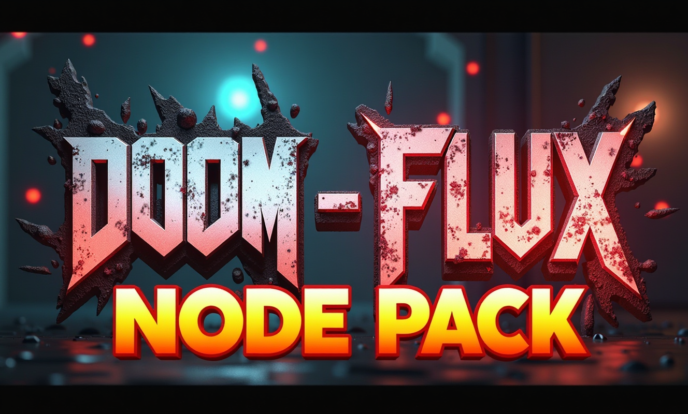
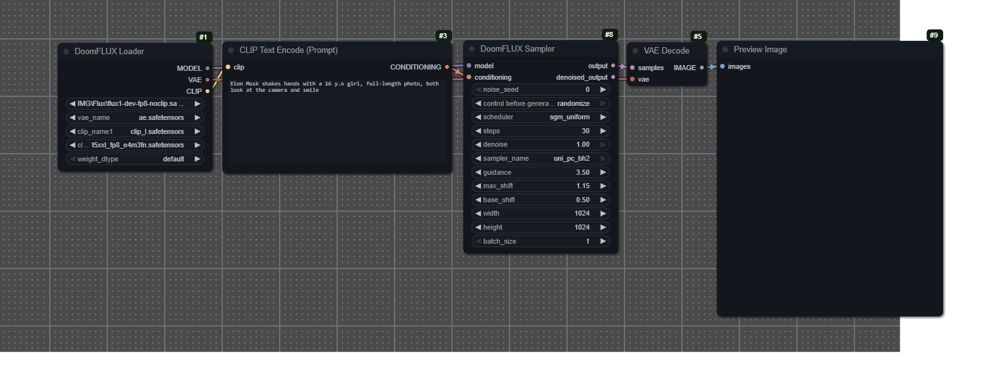
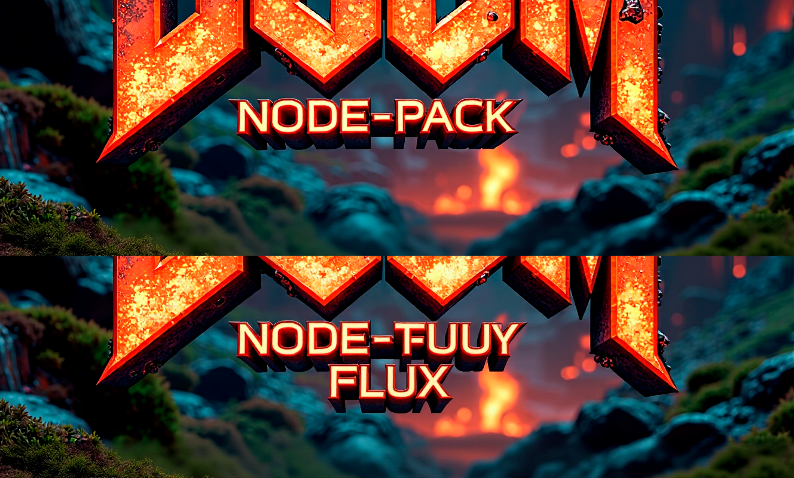
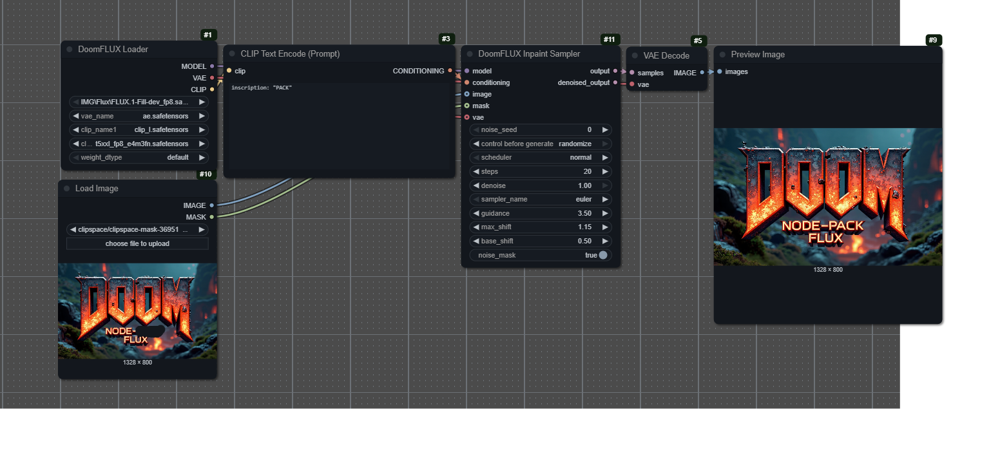
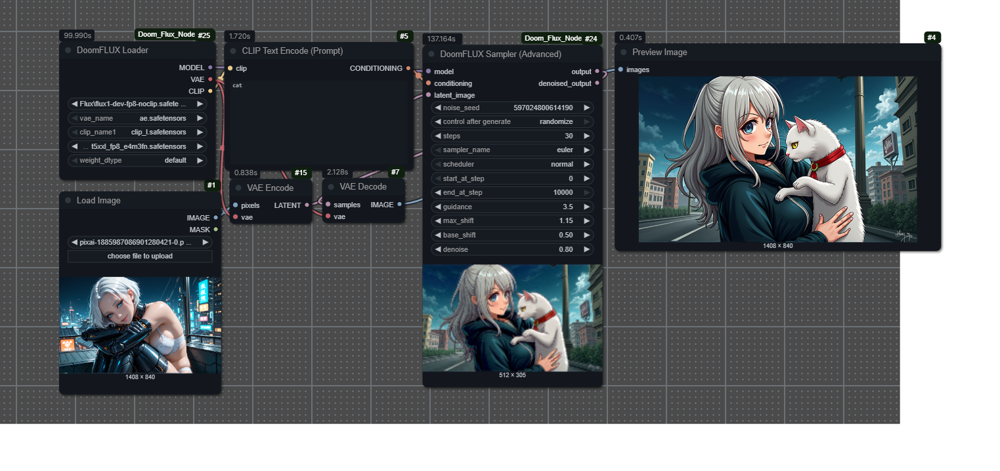

# DoomFLUX Nodes for ComfyUI

This repository contains a set of custom nodes for [ComfyUI](https://github.com/comfyanonymous/ComfyUI), designed to work with the FLUX family of models. They include a convenient loader and custom samplers for standard generation and inpainting, which utilize the specific `shift` logic required by FLUX.

---

## Included Nodes

*   **DoomFLUX Loader**: Simplifies loading FLUX models. It allows selecting the diffusion model, VAE, and up to two text encoders (CLIP) in a single node. It also supports loading models with reduced precision (fp8).
*   **DoomFLUX Sampler**: A custom sampler for image generation. It automatically calculates and applies the `shift` parameter required for FLUX models to work correctly, based on the image resolution.
*   **DoomFLUX Inpaint Sampler**: A specialized sampler for inpainting. It prepares the mask and image, then uses the same `shift` logic as the main sampler to generate only within the masked area.

## Installation

1.  Navigate to your `ComfyUI/custom_nodes/` directory.
2.  Clone this repository:
    ```
    https://github.com/PeterMikhai/Doom_Flux_NodePack.git
    ```
3.  Restart ComfyUI. The nodes will appear in the `DoomFlux` category.

This package currently has no external dependencies, so you don't need to run `pip install`.

## Workflow Examples / Примеры рабочих процессов

Below are examples demonstrating how to use the DoomFLUX nodes. The generated images on the left can be dragged and dropped directly into ComfyUI to load the workflow.

---

### Text-to-Image with FLUX

*   [Download workflow file (.json)](./workflows/flux_txt2img_example.json)

| Generated Result (Drag-and-Drop) | Workflow Structure |
| :---: | :---: |
|  |  |

---

### Inpainting with FLUX

*   [Download workflow file (.json)](./workflows/flux_inpaint_example.json)

| Generated Result (Drag-and-Drop) | Workflow Structure |
| :---: | :---: |
|  |  |

---
### Advanced Sampler (Image-to-Image)

An advanced sampler for `img2img` tasks, providing full control over the denoising process, similar to KSamplerAdvanced.

*   [Download workflow file (.json)](./workflows/flux_img2img_example.json)

| Generated Result (Drag-and-Drop) | Workflow Structure |
| :---: | :---: |
|  |  |

---


## --- Русский ---

# DoomFLUX Nodes для ComfyUI

Этот репозиторий содержит набор кастомных узлов для [ComfyUI](https://github.com/comfyanonymous/ComfyUI), предназначенных для работы с моделями семейства FLUX. Они включают в себя удобный загрузчик, а также кастомные семплеры для стандартной генерации и инпеинтинга, которые используют специфическую логику `shift`, необходимую для FLUX.

---

## Включенные узлы

*   **DoomFLUX Loader**: Упрощает загрузку моделей FLUX. Позволяет в одном узле выбрать диффузионную модель, VAE и до двух текстовых энкодеров (CLIP). Также поддерживает загрузку моделей с пониженной точностью (fp8).
*   **DoomFLUX Sampler**: Кастомный семплер для генерации изображений. Автоматически вычисляет и применяет параметр `shift`, необходимый для корректной работы моделей FLUX, на основе разрешения изображения.
*   **DoomFLUX Inpaint Sampler**: Специализированный семплер для инпеинтинга. Он подготавливает маску и изображение, а затем использует ту же логику `shift`, что и основной семплер, для генерации только в замаскированной области.

## Установка

1.  Перейдите в директорию `ComfyUI/custom_nodes/` на вашем компьютере.
2.  Клонируйте этот репозиторий с помощью команды:
    ```
    https://github.com/PeterMikhai/Doom_Flux_NodePack.git
    ```  
3.  Перезапустите ComfyUI. Новые узлы появятся в категории `DoomFlux`.

У этого пакета на данный момент нет внешних зависимостей, поэтому запускать `pip install` не требуется.

## Примеры рабочих процессов / Workflow Examples

Ниже приведены примеры использования узлов DoomFLUX. Изображения слева можно перетащить прямо в окно ComfyUI, чтобы загрузить рабочий процесс.

---

### Текст в картинку с помощью FLUX

*   [Скачать файл воркфлоу (.json)](./workflows/flux_txt2img_example.json)

| Сгенерированный результат (можно перетащить) | Структура рабочего процесса |
| :---: | :---: |
|  |  |

---

### Инпеинтинг с помощью FLUX

*   [Скачать файл воркфлоу (.json)](./workflows/flux_inpaint_example.json)

| Сгенерированный результат (можно перетащить) | Структура рабочего процесса |
| :---: | :---: |
|  |  |

### Картинка в картинку (Image-to-Image)

Продвинутый семплер для задач `img2img`, который дает полный контроль над процессом "разшумливания", аналогично KSamplerAdvanced.

*   [Скачать файл воркфлоу (.json)](./workflows/flux_img2img_example.json)

| Сгенерированный результат (можно перетащить) | Структура рабочего процесса |
| :---: | :---: |
|  |  |